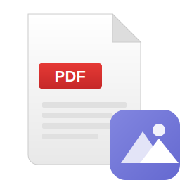

# Galerie MSIX Packaging

This directory contains configuration files for packaging Galerie as a Windows MSIX application with custom file type icons.

## Why MSIX?

PWAs (Progressive Web Apps) cannot control how Windows Explorer displays file icons. The `file_handlers.icons` in the web manifest only affects the "Open With" dialog, not the actual file icons in Explorer.

To show Galerie-branded icons for associated files in Windows Explorer, the app must be packaged as an MSIX and distributed through the Microsoft Store or sideloaded.

## File Type Icons

The following custom icons are included:

| File Type | Icon | Extensions |
|-----------|------|------------|
| Images |  | .jpg, .png, .gif, .webp, .svg, etc. |
| Videos |  | .mp4, .mkv, .avi, .mov, etc. |
| Audio |  | .mp3, .wav, .flac, .ogg, etc. |
| PDF |  | .pdf |

Each icon features:
- A document base design
- File type indicator (waveform for audio, play button for video, etc.)
- Galerie logo badge in the bottom-right corner

## Prerequisites

1. **Generate Icons**: Run the icon generation script first:
   ```bash
   npm run generate-icons
   ```
   This creates PNG and ICO files from the SVG sources.

2. **Install png-to-ico** (for ICO generation):
   ```bash
   npm install --save-dev png-to-ico
   ```

## Packaging Options

### Option 1: PWABuilder (Recommended)

The easiest way to create an MSIX package:

1. Go to [PWABuilder](https://pwabuilder.com)
2. Enter your PWA URL
3. Click "Package for stores" → "Windows"
4. Upload the `pwabuilder.json` configuration
5. Download the generated MSIX package

### Option 2: Manual MSIX Creation

For more control over the packaging process:

1. Install [Windows SDK](https://developer.microsoft.com/windows/downloads/windows-sdk/)

2. Create the package structure:
   ```
   GaleriePackage/
   ├── AppxManifest.xml
   ├── icons/
   │   ├── icon-48x48.png
   │   ├── icon-192x192.png
   │   ├── icon-256x256.png
   │   ├── icon-512x512.png
   │   └── filetypes/
   │       ├── image.ico
   │       ├── video.ico
   │       ├── audio.ico
   │       └── pdf.ico
   └── ... (PWA files)
   ```

3. Create the MSIX package:
   ```bash
   makeappx pack /d GaleriePackage /p Galerie.msix
   ```

4. Sign the package (required for installation):
   ```bash
   signtool sign /fd SHA256 /a /f YourCertificate.pfx /p YourPassword Galerie.msix
   ```

### Option 3: Visual Studio

1. Create a "Windows Application Packaging Project"
2. Add the PWA as a reference
3. Configure file associations in Package.appxmanifest
4. Build and publish

## Configuration Files

### pwabuilder.json

PWABuilder-specific configuration that defines:
- App identity and publisher info
- File type associations with custom icons
- Target platforms and capabilities

### AppxManifest.xml

Standard Windows app manifest template with:
- Visual elements (icons, splash screen)
- File type associations
- Protocol handlers
- Required capabilities

## Distribution

### Microsoft Store

1. Create a developer account at [Partner Center](https://partner.microsoft.com)
2. Submit the MSIX package for certification
3. Users install from the Store (automatic updates)

### Sideloading

1. Enable "Developer mode" or "Sideload apps" in Windows Settings
2. Distribute the signed MSIX file
3. Users double-click to install

### Enterprise Deployment

1. Use Microsoft Intune or SCCM
2. Deploy via Group Policy
3. Use Windows Package Manager (winget)

## Limitations

- **Not true overlays**: The icons replace the default file type icons entirely, rather than adding a badge overlay to existing icons
- **System-wide**: When Galerie is set as the default app, ALL files of that type will show the Galerie icon
- **Requires installation**: The MSIX must be installed for icons to appear

## Troubleshooting

### Icons not appearing

1. Ensure ICO files are generated: `npm run generate-icons`
2. Verify ICO files exist in `icons/filetypes/`
3. Rebuild the MSIX package
4. Clear Windows icon cache:
   ```cmd
   ie4uinit.exe -show
   ```

### File associations not working

1. Check Windows Settings → Default apps
2. Ensure Galerie is set as default for the file type
3. Verify the MSIX is properly signed and installed

## Related Files

- [`icons/filetypes/*.svg`](../icons/filetypes/) - Source SVG icons
- [`scripts/generate-icons.js`](../scripts/generate-icons.js) - Icon generation script
- [`manifest.json`](../manifest.json) - PWA web manifest
