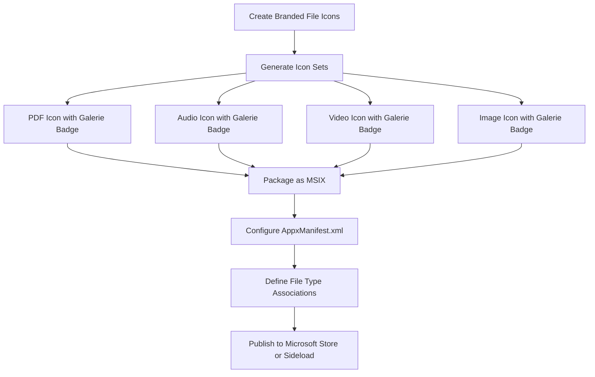

# Windows File Icon Overlay for Galerie PWA

## Research Summary

### 1. How Windows Handles Icon Overlays for File Associations

Windows has **two distinct mechanisms** for file icons:

#### A. File Type Icons (Default Icons)
- Controlled via Windows Registry under `HKEY_CLASSES_ROOT`
- Each file extension can have a `DefaultIcon` registry key pointing to an `.ico` file
- When you install a native application, it registers itself as a handler and sets custom icons

#### B. Icon Overlays (Badges)
- Managed through Shell Icon Overlay Handlers
- Requires a COM object registered in `HKEY_LOCAL_MACHINE\SOFTWARE\Microsoft\Windows\CurrentVersion\Explorer\ShellIconOverlayIdentifiers`
- Used by apps like OneDrive, Dropbox, Git for sync status indicators
- **Limited to 15 overlay handlers system-wide** - Windows only loads the first 15 alphabetically
- Requires native code (C++/C# DLL) to implement `IShellIconOverlayIdentifier` interface

### 2. PWA Limitations

**Critical Finding: PWAs cannot control Windows Explorer file icons.**

Here's why:

| Feature | PWA Capability | Native App Capability |
|---------|---------------|----------------------|
| File Handler Registration | ✅ Yes, via `file_handlers` in manifest | ✅ Yes, via registry |
| Custom File Type Icons | ❌ No | ✅ Yes, via `DefaultIcon` registry |
| Icon Overlays/Badges | ❌ No | ✅ Yes, via Shell Icon Overlay Handlers |
| "Open With" Menu | ✅ Yes | ✅ Yes |

**What the PWA `file_handlers.icons` actually does:**
- The `icons` array in `file_handlers` is used for the **"Open With" dialog** and **app picker UI**
- It does NOT change how files appear in Windows Explorer
- Windows Explorer uses its own icon resolution based on registry entries

### 3. Why Files Show Generic Icons

When you see a generic white document icon for `.pdf` or audio files:
1. Windows looks up the file extension in the registry
2. If no application has registered a `DefaultIcon` for that extension, Windows uses a generic icon
3. PWAs cannot write to the Windows Registry
4. Therefore, PWAs cannot change file icons in Explorer

### 4. Alternative Approaches Analysis

#### Option A: Create Custom File Type Icons (NOT POSSIBLE for PWAs)
- **Requirement**: Write to Windows Registry
- **PWA Support**: ❌ Not possible - PWAs run in a sandboxed browser environment

#### Option B: Icon Overlays via Manifest (NOT SUPPORTED)
- **Current Spec**: The `file_handlers.icons` property exists but only affects the app picker
- **Future Spec**: No proposals exist to allow PWAs to set Explorer file icons

#### Option C: Composite Icons (NOT APPLICABLE)
- This would require the same registry access as Option A
- Creating icons that combine document + Galerie badge would work visually
- But there's no way to make Windows use them for file display

#### Option D: Electron/Tauri Wrapper (POSSIBLE but requires native app)
- Wrap the PWA in Electron or Tauri
- Use native APIs to register file associations with custom icons
- **Trade-off**: Loses the "pure PWA" nature, requires app distribution

#### Option E: Windows Package (MSIX) with PWA (PARTIAL SOLUTION)
- Package the PWA as an MSIX using PWABuilder
- MSIX packages CAN register file type associations with custom icons
- **Limitation**: Still cannot do icon overlays, only full icon replacement

---

## Recommended Solution

### Best Available Option: MSIX Package with Custom File Type Icons

Since true icon overlays are not possible without native code, the closest achievable solution is:

1. **Create custom file type icons** that include the Galerie branding
2. **Package the PWA as MSIX** using PWABuilder
3. **Register file associations** with these custom icons in the MSIX manifest

### Implementation Plan



### Step-by-Step Implementation

#### Phase 1: Create Branded File Type Icons

Create composite icons that show:
- A document/file base icon
- The Galerie logo as a badge in the bottom-right corner

Icon sizes needed for Windows:
- 16x16 (small icons view)
- 32x32 (medium icons)
- 48x48 (large icons)
- 256x256 (extra large icons)

File types to create icons for:
- PDF documents
- Audio files (MP3, WAV, FLAC, etc.)
- Video files (MP4, MKV, etc.)
- Image files (JPG, PNG, etc.)

#### Phase 2: Update Icon Generation Script

Modify [`scripts/generate-icons.js`](scripts/generate-icons.js:1) to:
1. Generate file-type-specific icons with Galerie badge
2. Create ICO files for each file type category
3. Output to a new `icons/filetypes/` directory

#### Phase 3: Create MSIX Package Configuration

Use PWABuilder or manual MSIX packaging:

```xml
<!-- Example AppxManifest.xml file type association -->
<Extensions>
  <uap:Extension Category="windows.fileTypeAssociation">
    <uap:FileTypeAssociation Name="galerie-pdf">
      <uap:DisplayName>Galerie PDF Document</uap:DisplayName>
      <uap:Logo>icons\filetypes\pdf.ico</uap:Logo>
      <uap:SupportedFileTypes>
        <uap:FileType>.pdf</uap:FileType>
      </uap:SupportedFileTypes>
    </uap:FileTypeAssociation>
  </uap:Extension>
</Extensions>
```

#### Phase 4: Build and Distribute

Options:
1. **Microsoft Store**: Submit MSIX for store distribution
2. **Sideloading**: Distribute MSIX directly (requires signing certificate)
3. **PWABuilder**: Use https://pwabuilder.com to generate MSIX automatically

---

## Limitations to Communicate to User

### What IS Possible
✅ Custom file icons (full replacement) when packaged as MSIX
✅ Galerie branding on file icons in Explorer
✅ "Open with Galerie" in context menu
✅ Galerie as default app for file types

### What is NOT Possible
❌ Icon overlays/badges on existing file icons (requires native Shell extension)
❌ Changing file icons without MSIX packaging
❌ Pure PWA solution for custom file icons
❌ Dynamic overlays based on file state

---

## Alternative: Minimal Native Helper

If true overlay functionality is required:

1. Create a small native Windows service/app
2. Implement `IShellIconOverlayIdentifier` COM interface
3. Register as Shell Icon Overlay Handler
4. Communicate with PWA via local server or file system

**Complexity**: High - requires C++/C# development, code signing, and separate installation.

---

## Recommendation

For the Galerie project, I recommend:

1. **Short-term**: Accept the PWA limitation and focus on the "Open With" experience
2. **Medium-term**: Package as MSIX with custom file type icons (not overlays)
3. **Long-term**: Consider Electron/Tauri wrapper if native features become critical

The MSIX approach provides the best balance of:
- Maintaining web technology stack
- Achieving branded file icons in Explorer
- Reasonable implementation effort
- No ongoing native code maintenance

---

## Next Steps

If you want to proceed with the MSIX solution:

1. [ ] Design composite file type icons (document + Galerie badge)
2. [ ] Update generate-icons.js to create file type icons
3. [ ] Set up PWABuilder or manual MSIX packaging
4. [ ] Configure file type associations in AppxManifest.xml
5. [ ] Test on Windows 10/11
6. [ ] Decide on distribution method (Store vs Sideload)

Would you like me to proceed with implementing any of these steps?
